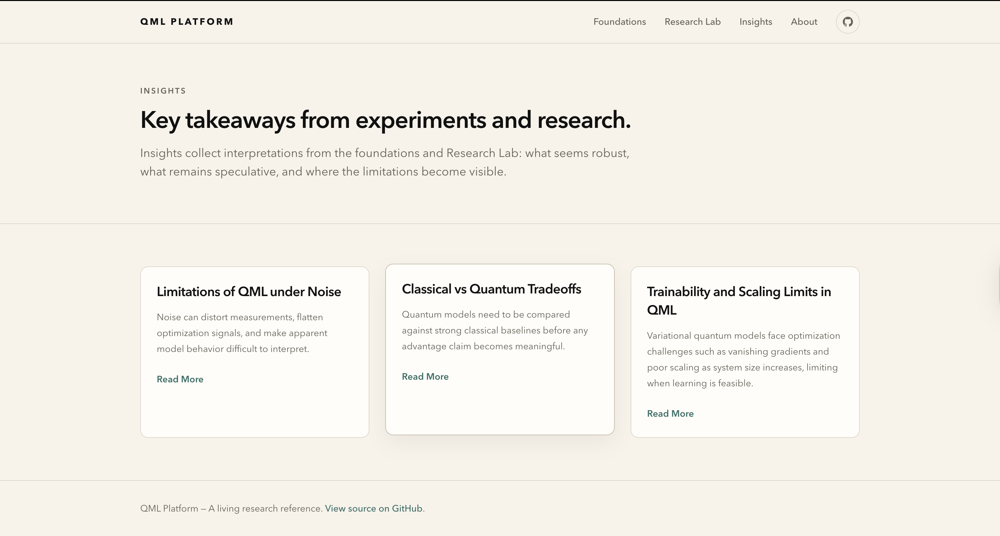
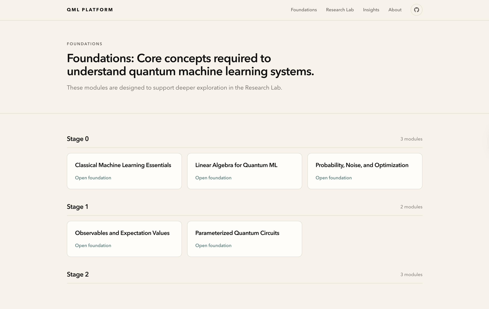
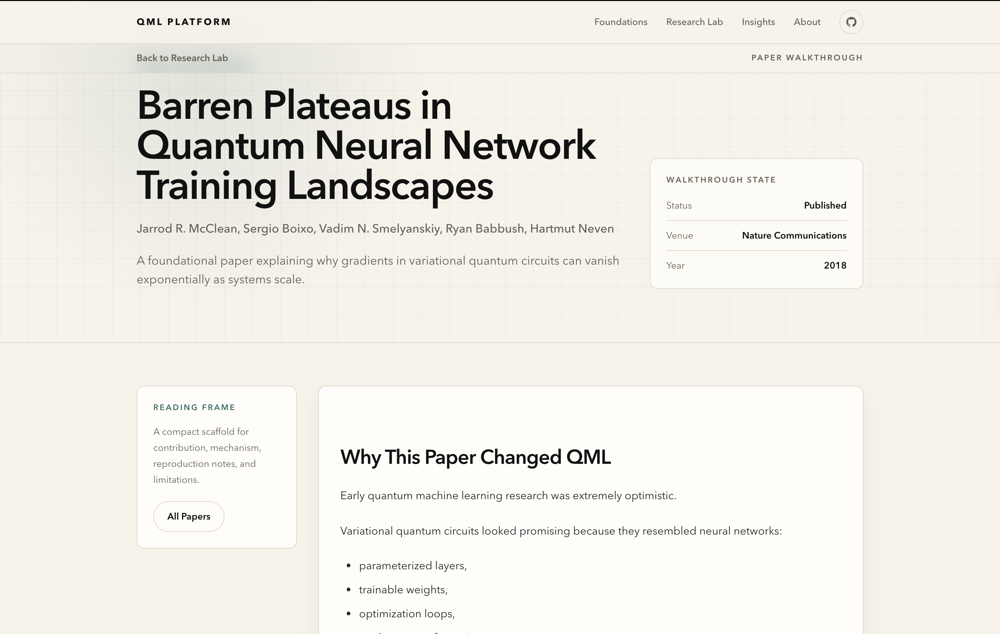

# QML Learning Platform

A structured, code-backed learning project for Quantum Machine Learning. It focuses on understanding how QML models behave under realistic constraints such as noise, scaling limits, and classical baselines.

This is a learning and exploration system rather than a polished commercial product or formal course.


## Core Idea

Quantum machine learning is often presented in idealized settings. This project instead emphasizes:

- What breaks under noise
- Why scaling introduces trainability issues
- How classical baselines affect claims of advantage
- Where quantum approaches are actually meaningful in practice

## Interface Preview

### Insights Page


### Foundations Module


### Example Research Paper Walkthrough 


## Features

- Next.js 14 App Router based web application
- MDX-based content system for structured learning modules
- KaTeX math rendering for equations and derivations
- Code-integrated explanations (PennyLane / Qiskit-ready examples)
- Research-style insights and failure-mode analysis

## Project Structure

```
├── app/
│   ├── page.tsx
│   ├── about/
│   ├── insights/
│   ├── learning-path/
│   ├── modules/
│   ├── code-notebooks/
│   └── research-commentary/
├── content/
│   ├── modules/
│   ├── insights/
│   └── research/
├── lib/
├── components/
└── ...
```

## Learning Model

Each module is designed around a consistent structure:

- Motivation and context
- Core concepts and mathematical framing
- Implementation examples (quantum circuits / code)
- Experimental behavior under constraints
- Failure modes and limitations
- Key takeaways

## Development

Install dependencies:

```bash
npm install
```

Run locally:

```bash
npm run dev
```

Open:

http://localhost:3000

## Build & Deployment

This project is designed for deployment on Vercel.

```bash
npm run build
```

In most cases, deployment is handled automatically through GitHub integration with Vercel.

## Content Workflow

- Add new modules in `content/modules/`
- Add insights in `content/insights/`
- Add research notes in `content/research/`

All content is written in MDX and rendered dynamically through the app router.

## Notes

- This is a living system; structure and content will evolve over time
- Emphasis is placed on correctness, constraints, and realistic QML behavior rather than theoretical claims of quantum advantage

## License

MIT
